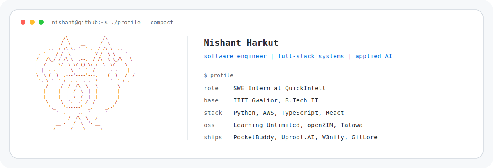

<picture>
  <source media="(prefers-color-scheme: dark) and (max-width: 700px)" srcset="assets/profile-terminal-v4-mobile-dark.svg">
  <source media="(max-width: 700px)" srcset="assets/profile-terminal-v4-mobile-light.svg">
  <source media="(prefers-color-scheme: dark)" srcset="assets/profile-terminal-v3-dark.svg">
  
</picture>

I build backend-heavy full-stack systems and applied AI products, with production Python/AWS work and merged open-source contributions.

Currently working as a SWE Intern at QuickIntell on Python and AWS systems for healthcare RCM workflows, including EOB-to-ERA extraction, schema normalization, and QA tooling.

### Selected Work

#### [PocketBuddy](https://github.com/nishantharkut/PocketBuddy)

Student finance system with passive payment sync, allowance runway tracking, shared cart pools, food and travel insights, and AI money nudges. Built across React, TypeScript, FastAPI, Python, Kotlin, and AWS. Amazon HackOn 6.0 finalist.

#### [Uproot.AI](https://github.com/nishantharkut/Uproot.AI)

Resume versioning and AI review platform with auth, Prisma data modeling, Cloudinary assets, Stripe flows, email, and controlled AI assistance.

#### [W3nity](https://github.com/nishantharkut/W3nity)

Web3 collaboration platform for gigs, events, wallet-linked flows, escrow-oriented work, and real-time community chat. MIT licensed and built with multiple contributors.

#### [GitLore](https://github.com/Codealpha07/GitLore)

Repository understanding tool with GitHub context, semantic code search, PR-aware workflows, and a browser-extension surface. HackByte 4.0 finalist.

### Open Source

- [Learning Unlimited ESP Website](https://github.com/learning-unlimited/ESP-Website): fixed keyboard accessibility for module management and added CSRF protection to Django forms. See [PR 4715](https://github.com/learning-unlimited/ESP-Website/pull/4715) and [PR 4691](https://github.com/learning-unlimited/ESP-Website/pull/4691).
- [openZIM mwoffliner](https://github.com/openzim/mwoffliner): fixed inline data URL image handling in MediaWiki offline exports. See [PR 2672](https://github.com/openzim/mwoffliner/pull/2672).
- [Palisadoes Talawa Admin](https://github.com/PalisadoesFoundation/talawa-admin): extracted reusable React selector components from action-item workflows. See [PR 6314](https://github.com/PalisadoesFoundation/talawa-admin/pull/6314) and [PR 6418](https://github.com/PalisadoesFoundation/talawa-admin/pull/6418).

### Recognition

- Amazon HackOn 6.0 finalist for PocketBuddy.
- Winner, Hackanovate 6.0 Agent.AI Track.
- Top 10, Odoo India Hackathon.
- Finalist, HackByte 4.0.

### Links

[Portfolio](https://www.nishantharkut.dev/) | [LinkedIn](https://www.linkedin.com/in/nishant-harkut/) | [Email](mailto:nhnishantharkut@gmail.com)
