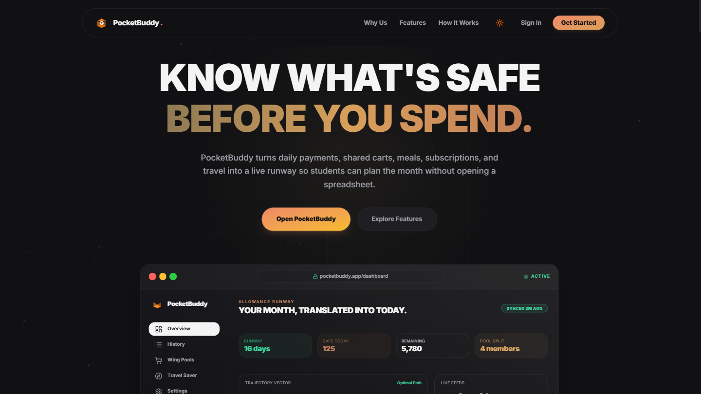
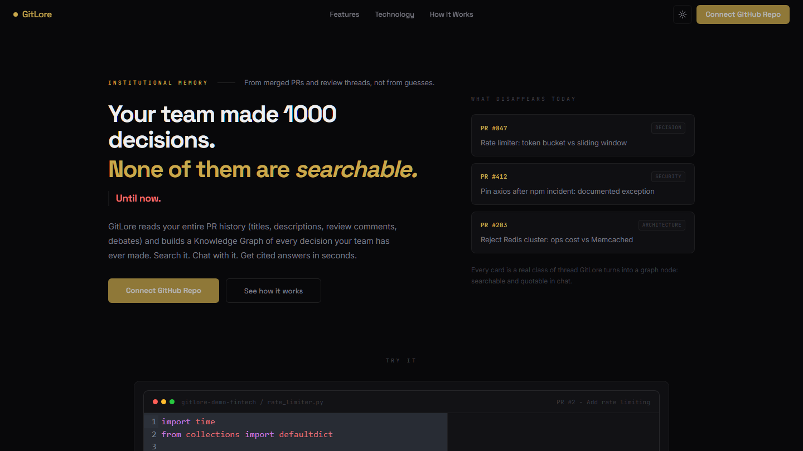

  <h1>Nishant Harkut</h1>
  
Information Technology at IIIT Gwalior &middot; Class of 2028

  

    <a href="https://www.nishantharkut.tech/">Portfolio</a>
    &nbsp;&middot;&nbsp;
    <a href="https://www.linkedin.com/in/nishant-harkut/">LinkedIn</a>
    &nbsp;&middot;&nbsp;
    <a href="mailto:nhnishantharkut@gmail.com">Email</a>
  

I work across the full stack. Most of my work uses React and TypeScript for the interface, with Python, FastAPI, PostgreSQL, and AWS behind it.

At [QuickIntell](https://quickintell.com/), I worked as a Software Engineering Intern on production healthcare RCM software, automated testing, debugging, and release QA. At [Cook N Klean](https://www.cooknklean.com/), I worked as a Product Design Engineering Intern, creating product screens and reusable Figma components.

## Projects

<table>
  <tr>
    <td width="50%">
      
    </td>
    <td width="50%">
      
    </td>
  </tr>
</table>

**[PocketBuddy](https://github.com/nishantharkut/PocketBuddy)** &middot; [Live](https://d3g6cg7q9hn7hi.cloudfront.net/) &middot; Amazon HackOn 6.0 Grand Finalist 
Student finance platform with HMAC-signed AWS ingestion, SQS/DLQ recovery, DynamoDB idempotency, and 166 Python tests.

**[GitLore](https://github.com/Codealpha07/GitLore)** &middot; [Live](https://gitlore-weld.vercel.app/) &middot; HackByte 4.0 finalist 
Searchable engineering decisions from pull requests and reviews, with 35+ Hono endpoints, signed GitHub webhooks, cited answers, and approval before draft pull requests.

## Open source

14 merged pull requests across two established open-source projects:

- **[Learning Unlimited, ESP Website](https://github.com/learning-unlimited/ESP-Website/pulls?q=is%3Apr+author%3Anishantharkut+is%3Amerged)** &middot; 9 merged pull requests covering Django regression tests, CSRF protection, WCAG 2.1.1 keyboard accessibility, and maintenance updates.
- **[Kiwix, openZIM mwoffliner](https://github.com/openzim/mwoffliner/pulls?q=is%3Apr+author%3Anishantharkut+is%3Amerged)** &middot; 5 merged pull requests covering TypeScript data URL handling, unit tests, dependency cleanup, and production logging.

## Tools

<table>
  <tr>
    <td width="22%"><strong>Languages</strong></td>
    <td>
      <picture>
        <source media="(prefers-color-scheme: dark)" srcset="./assets/icons/filled-languages-dark.svg">
        
      </picture> 
      Python &middot; TypeScript &middot; JavaScript &middot; C and C++
    </td>
  </tr>
  <tr>
    <td><strong>Web and APIs</strong></td>
    <td>
      <picture>
        <source media="(prefers-color-scheme: dark)" srcset="./assets/icons/filled-web-dark.svg">
        
      </picture> 
      React &middot; Next.js &middot; Node.js &middot; Express &middot; Hono &middot; FastAPI &middot; Django
    </td>
  </tr>
  <tr>
    <td><strong>Data and infrastructure</strong></td>
    <td>
      <picture>
        <source media="(prefers-color-scheme: dark)" srcset="./assets/icons/filled-data-dark.svg">
        
      </picture> 
      PostgreSQL &middot; MySQL &middot; MongoDB &middot; AWS &middot; Docker &middot; Linux
    </td>
  </tr>
  <tr>
    <td><strong>Workflow</strong></td>
    <td>
      <picture>
        <source media="(prefers-color-scheme: dark)" srcset="./assets/icons/filled-workflow-dark.svg">
        
      </picture> 
      Git &middot; GitHub &middot; Postman &middot; Figma &middot; Claude Code &middot; Codex &middot; Cursor
    </td>
  </tr>
</table>
